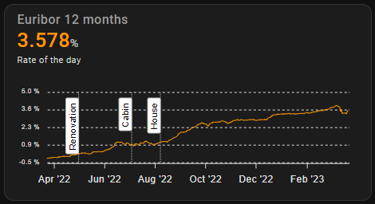

# Euribor rates for Home Assistant

Home Assistant integration for the Euribor rates published by euribor-rates.eu.

[![GitHub Release][releases-shield]][releases]
[![License][license-shield]](LICENSE)
[![GitHub Activity][commits-shield]][commits]

## Support

Hey dude! Help me out for a couple of :beers: or a :coffee:!

[](https://www.buymeacoffee.com/jesmak)

## What is it?

A custom component that follows the Euribor rates from [euribor-rates.eu](https://www.euribor-rates.eu/). Add the
integration once and give it a maturity; add more maturities to it whenever you like. Each one gets a sensor for its
newest rate and another for the day that rate was published.

The rates of earlier days are kept in Home Assistant's own long term statistics, so a year of Euribor can be drawn
with any card that reads statistics, and the numbers survive a restart and the recorder's purging.

## Installation

### With HACS

1. Add this repository to HACS custom repositories with type **Integration**
2. Search for Euribor rates in HACS and download it
3. Restart Home Assistant
4. Add the integration in Settings › Devices & services, and choose a maturity

### Manual

1. Download the source code from the latest release
2. Copy the `custom_components/euribor_rates` folder to your Home Assistant installation's `config/custom_components`
   folder
3. Restart Home Assistant
4. Add the integration in Settings › Devices & services, and choose a maturity

## Settings

Adding the integration asks for the first maturity and how far back to read its history. Further maturities are added
from the integration page with **Add maturity**; the ones already being followed are left out of the list. Choosing
**Reconfigure** on a maturity changes how far back it reaches and reads that history again.

| Name                | Type   | Description                                                      | Default |
| ------------------- | ------ | ---------------------------------------------------------------- | ------- |
| Maturity            | enum   | `1 week`, `1 month`, `3 months`, `6 months` or `12 months`        |         |
| History to import   | number | How far back the rates are read when the maturity is added, in days | 365     |

## Sensors

Each maturity has two:

| Sensor                                | What it holds                                  |
| ------------------------------------- | ---------------------------------------------- |
| `sensor.euribor_12_months`            | The newest published rate, as a percentage     |
| `sensor.euribor_12_months_published`  | The day that rate was published                |

The rate sensor also carries `latest_rate`, `latest_date` and `maturity` as attributes. The published sensor is the
one to build a staleness alarm on: rates come on working days, so a publication date more than a few days old means
something is wrong at the source.

## The history

Every rate read is written into the statistics of the rate sensor itself, so the series is queried like any other
sensor's statistics. Home Assistant's own statistics graph card draws it, and so does apexcharts-card.

After the first read, each update asks only for the days since the newest rate already stored, and one more for
safety. A weekend costs a three day request, a fortnight's outage heals itself on the first update afterwards, and an
ordinary day asks for a single day. Nothing has to be reconfigured to recover from a gap.

## Usage with apexcharts-card

One use for this integration is a chart of the rates with [apexcharts-card](https://github.com/RomRider/apexcharts-card),
which reads the sensor's statistics:

```yaml
type: custom:apexcharts-card
graph_span: 365d
header:
  show: true
  title: Euribor 12 months
  show_states: true
series:
  - entity: sensor.euribor_12_months
    statistics:
      type: mean
      period: day
    stroke_width: 1
    float_precision: 3
```

A fuller chart, with the rate over a year and annotations marking the days a loan's rate is updated:



```yaml
type: custom:apexcharts-card
graph_span: 365d
header:
  show: true
  title: Euribor 12 months
  show_states: true
  colorize_states: true
all_series_config:
  curve: straight
apex_config:
  chart:
    height: 150px
  legend:
    show: false
  annotations:
    xaxis:
      - x: 1659928000000 # these have to be timestamps (in milliseconds)
        label:
          style:
            color: '#000'
          text: House
      - x: 1656928000000
        label:
          style:
            color: '#000'
          text: Cabin
      - x: 1651384000000
        label:
          style:
            color: '#000'
          text: Renovation
series:
  - entity: sensor.euribor_12_months
    statistics:
      type: mean
      period: day
    stroke_width: 1
    float_precision: 3
    yaxis_id: daily
    name: Rate of the day
yaxis:
  - id: daily
    min: -0.5
    max: 5
    apex_config:
      tickAmount: 4
      labels:
        style:
          fontSize: 8px
        formatter: |
          EVAL:function(value) {
            return value.toFixed(1) + ' %';
          }
```

## Upgrading from 1.x

The maturities you follow, their sensors, their entity IDs and any names you have given them all carry over. Two
things change:

- **The `history` attribute is gone.** The rates now live in the sensor's statistics instead, which is what the
  configuration above reads. A chart built on `entity.attributes.history` has to be changed to the `statistics` form.
- **The maturities are now inside one integration entry** rather than one entry each, so a maturity can only be added
  once and they are managed together.

## Data

Euribor rates: [euribor-rates.eu](https://www.euribor-rates.eu/).

## Development

Requires Python 3.14.

```
python3.14 -m venv .venv
.venv/bin/pip install -r requirements_test.txt
.venv/bin/pytest
.venv/bin/ruff check .
```

| Path                           | What it contains                                       |
| ------------------------------ | ------------------------------------------------------ |
| `__init__.py`                  | Setup                                                  |
| `migration.py`                 | Turning the entries of 1.x into one                    |
| `config_flow.py`               | Adding the integration and its maturities              |
| `api.py`                       | The chart endpoint of euribor-rates.eu                 |
| `rates.py`                     | Reading the rates it sends                             |
| `window.py`                    | How far back each request reaches                      |
| `statistics.py`                | Keeping the rates in long term statistics              |
| `coordinator.py`               | Fetching and storing, every three hours                |
| `sensor.py`                    | The rate and its publication day                       |
| `translations/<language>.json` | Home Assistant UI texts                                |

[commits-shield]: https://img.shields.io/github/commit-activity/y/jesmak/euribor_rates.svg?style=for-the-badge
[commits]: https://github.com/jesmak/euribor_rates/commits/main
[license-shield]: https://img.shields.io/github/license/jesmak/euribor_rates.svg?style=for-the-badge
[releases-shield]: https://img.shields.io/github/release/jesmak/euribor_rates.svg?style=for-the-badge
[releases]: https://github.com/jesmak/euribor_rates/releases
